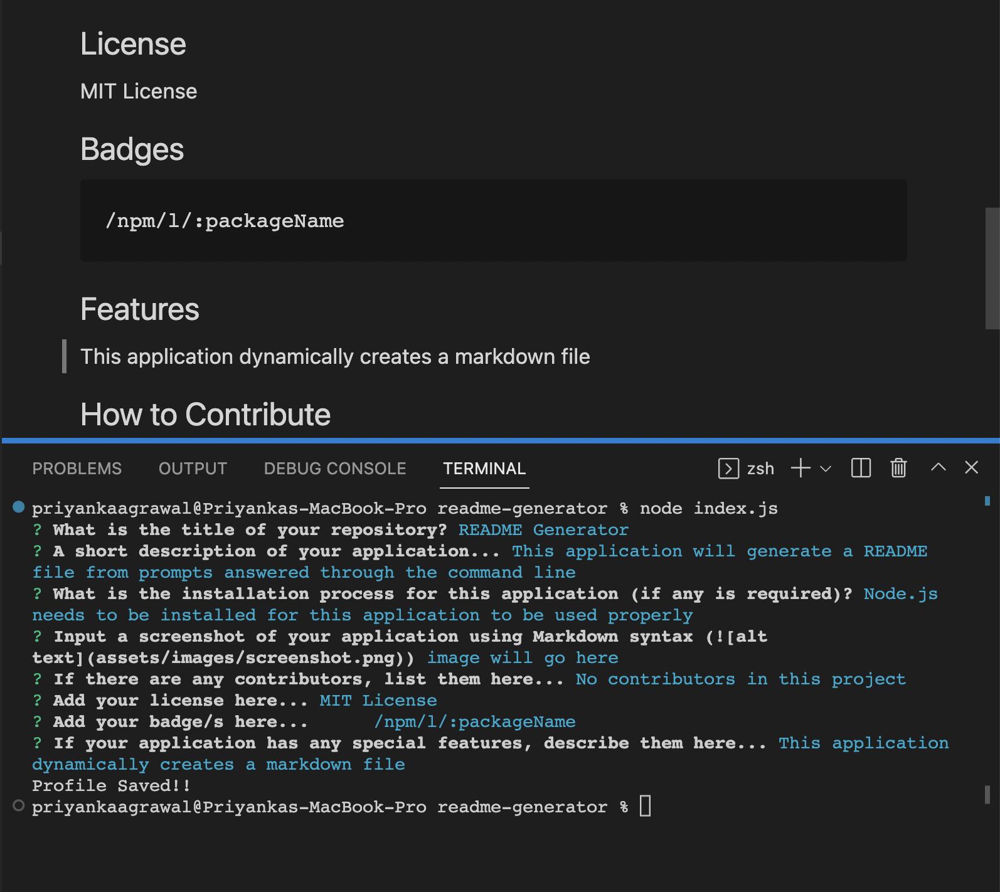

# Dynamic README Generator

## Description
This is a command line application, which will prompt terminal questions to dynamically genrate a README file for the user. The user will answer the prompts with information they would like to include in their file; that information will be accurately displayed in the file that has genrated.

## Installation
+ Node.js must be installed to the user's device in order for this application to function
+ The NPM package, Inquirer (version ^8.2.4) must be installed for this application to function accurately

## Usage

+ Link to Screencastify: https://drive.google.com/file/d/14tkfKsrH7NMiAage6d3a_Xp3OTINkOIW/view
+ Link to Github Repo: https://github.com/priyanka-agrawal025/readme-generator

## Credits
+ There were no collaborators on this project

## Licenses
+ An MIT License was used for this project

## Badges

## Features
+ Dyanmically generated Markdown file
